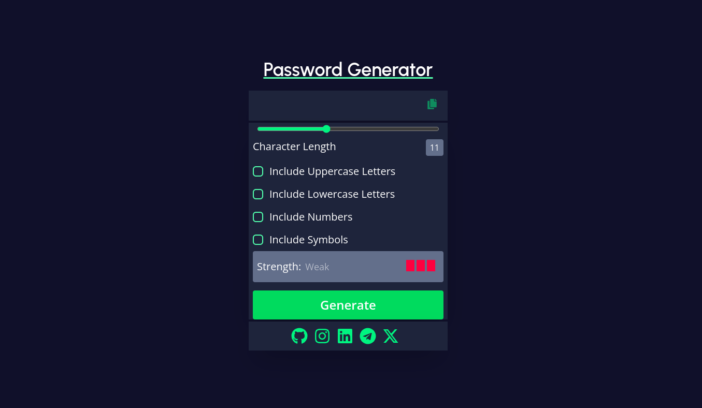

# React + Vite

# Password_Generator

This project is used to generate password based on the user preferences on like(uppercase,lowercase,symbol,number) and tell the strength like(Strong,Weak,and Medium)

#Run

npm i

npm run dev

# Password_Generator
